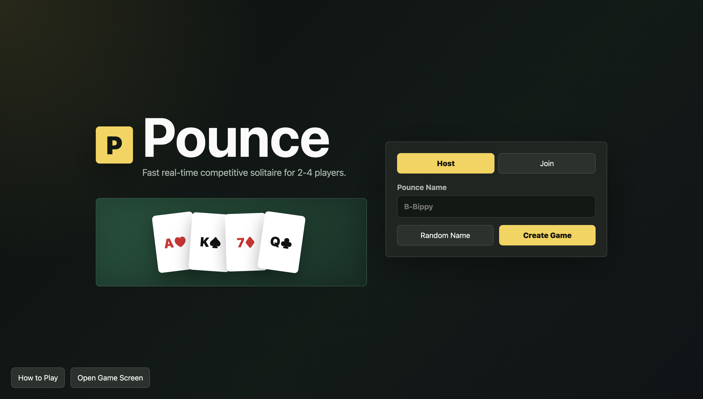

# Pounce



## About

Pounce is a real-time multiplayer browser card game based on fast competitive solitaire. Two to four players join a shared room, race to empty their Pounce piles, and play into shared center foundations at the same time.

No accounts are required. Players choose temporary Pounce Names and share a short room code.

## Rules

Each player has a private 52-card deck. At the beginning of a round, every player receives a 7-card Pounce pile, five start piles, and a stock pile. The start piles are dealt with 1, 2, 3, 4, and 5 cards; only the top card of each start pile is face up. The Pounce pile has one exposed top card. Empty start piles can be started with the exposed Pounce card or with a King.

Center piles are shared by all players. A center pile starts with an Ace and builds upward by suit through King. Start piles build downward while alternating red and black. Stock starts with draw-three rules, and only the exposed waste card can be played. During a game, players can unanimously vote to switch stock drawing to one card at a time. Players can also unanimously vote to end the current round early and score immediately.

When a player empties their Pounce pile, they can call POUNCE. The round stops immediately. Each center card owned by a player is worth +1. Each card remaining in that player's Pounce pile is worth -1. Rounds continue until at least one player reaches 100 points; the highest total score wins.

## Technology

- Vanilla JavaScript
- Node.js
- HTML5
- CSS3
- Express
- Socket.IO
- Node's built-in test runner

## Project Structure

```text
pounce/
├── public/
│   ├── index.html
│   ├── game.html
│   ├── css/
│   └── js/
├── server/
│   ├── gameEngine.js
│   ├── roomManager.js
│   ├── socketHandlers.js
│   └── utils.js
├── test/
├── server.js
├── package.json
└── README.md
```

## Installation

```bash
npm install
```

## Running Locally

```bash
npm start
```

Development mode:

```bash
npm run dev
```

The server listens on `0.0.0.0` by default so phones and other computers on the same network can connect to the printed network URL.

## Multiplayer Architecture

The Node.js server is authoritative. Browsers only send requested actions such as "play this exposed card to this center pile" or "draw stock." Clients never submit card ranks, suits, ownership, scores, or full game state.

Socket.IO broadcasts sanitized public room state to everyone and private card state only to the owning player. Opponents see names, scores, connection state, and Pounce counts, but not hidden card values.

## Game Engine

Rules live in `server/gameEngine.js`, separate from Socket.IO handlers. The engine controls deck creation, shuffling, round setup, foundation moves, start-pile moves, start-pile stack moves, stock cycling, Pounce calls, scoring, and round finishing.

Shared center moves are processed atomically by the server event loop. If two players race to play onto the same foundation, the first valid request accepted by the server changes the pile. The later request is revalidated against the changed pile and rejected if it no longer fits.

## Socket Events

Client to server:

- `room:create`
- `room:join`
- `room:leave`
- `room:reconnect`
- `game:start`
- `card:foundation`
- `card:tableau`
- `card:tableauStack`
- `stock:draw`
- `stock:voteDrawOne`
- `round:voteEndEarly`
- `pounce:call`
- `round:ready`
- `round:start`
- `game:restart`

Server to client:

- `room:created`
- `room:joined`
- `room:update`
- `room:error`
- `game:started`
- `game:publicState`
- `game:privateState`
- `card:moved`
- `move:rejected`
- `stock:updated`
- `stock:drawModeChanged`
- `round:endedEarly`
- `player:disconnected`
- `pounce:called`
- `round:results`
- `round:started`
- `game:finished`

## Deployment

Deploy as one Node.js service. Express serves `public/`, and Socket.IO shares the same HTTP server:

```text
Browser
  |
Node.js + Express + Socket.IO
  |
Authoritative Game Engine
```

Set `PORT` if your hosting provider requires a specific port.

## Testing

```bash
npm test
```

The tests cover foundation rules, start-pile rules, start-pile stack movement, Pounce reveal/refill behavior, stock cycling, scoring, Pounce validation, post-round move rejection, and simultaneous center move rejection.

With the server already running, you can also run a two-client Socket.IO smoke flow:

```bash
npm run smoke
```
